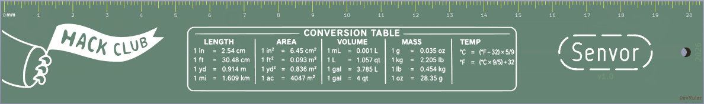
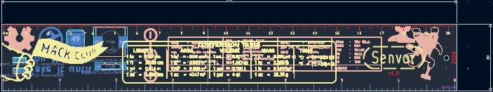
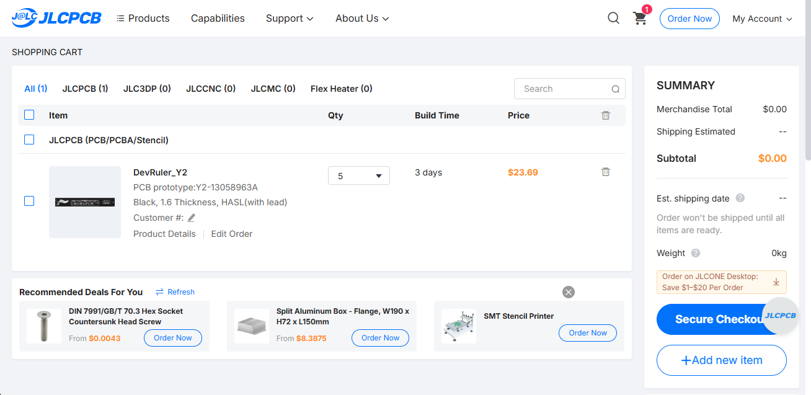

# DevRuler

**A custom PCB ruler for developers to show off their identity without saying a word.**

---

## What exactly is it?

It's a practical, everyday ruler designed specifically for developers and hardware hackers. I packed it with handy references that actually help in daily life, including:

- **Hardware footprints** for quick sizing and reference.
- **Daily use commands** right at a glance.
- **Basic SI unit conversions** so you never have to Google them again.
- Sweet branding from [Hack Club](https://hackclub.com/) and their awesome hardware program, [Forge](https://forge.hackclub.com/)!

## Why I built it

One day, while exploring the depths of YouTube, I stumbled upon a video showcasing a ruler made entirely out of a PCB. I immediately thought: *"What if I made one for myself? That would be **so** cool."* 

I wanted to actually build it, so I started looking for good hardware programs. That's when I found **Forge** an incredibly cool, hardware-focused program by Hack Club, I jumped right in and started designing!

## The PCB Design

I designed the entire board from scratch using **KiCad**. 

  
   
  <i>A look at the raw KiCad layout.</i>

## Fabrication (JLCPCB)

Here's the final manufacturing quote and preview from JLCPCB before it becomes reality:

  

---
